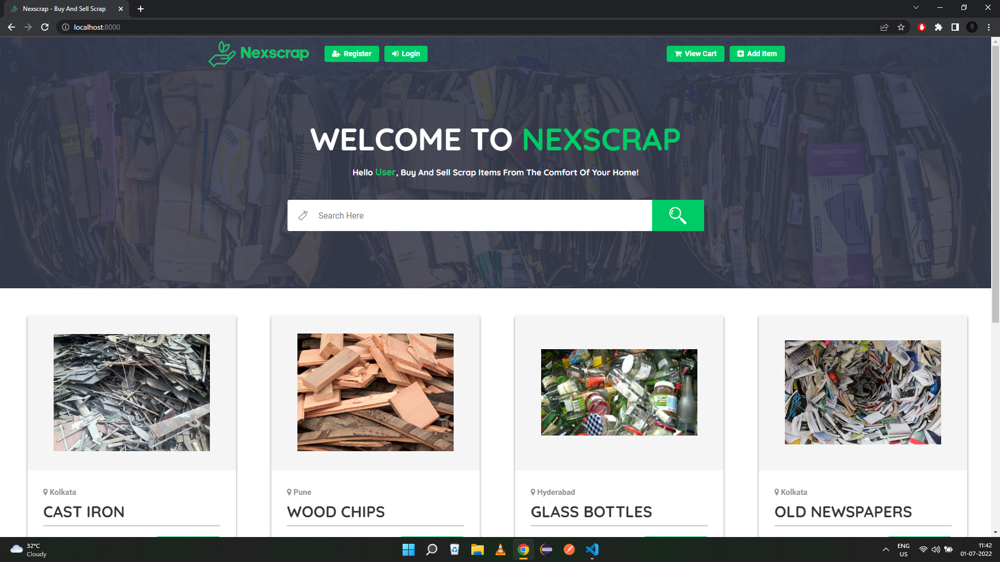

# nexscrap-classified

**Description** : Web Application to Buy/Sell Scrap Items

**Requisite** : Make sure you have Python3 and Pip installed in your System

**How to Run (Windows)** :

1. Install requirements.txt to install necessary packages [**pip install -r requirements.txt**]

2. Go to nexscrap -> settings.py -> Edit line nos. 133-138 and add your own Razorpay and Twilio credentials

3. Runserver on localhost [**python manage.py runserver**]

4. Go to http://localhost:8000 on your browser to visit Nexscrap Home

5. Go to http://localhost:8000/admin on your browser to visit Admin Panel

**Pre-Existing User Credentials** :

1. Superuser -> Username : admin, Password : admin123

2. User1 -> Useranme : buyer, Password : buyer123

3. User2 -> Username : seller, Password : seller123

**How to Remove existing DB & Make new DB** : 

1. Delete the db.sqlite3 file

2. Create new migration [**python manage.py makemigrations**]

3. Run the new migration [**python manage.py migrate**]

5. Create new Superuser [**python manage.py createsuperuser**]

**Sample Screenshot** :

